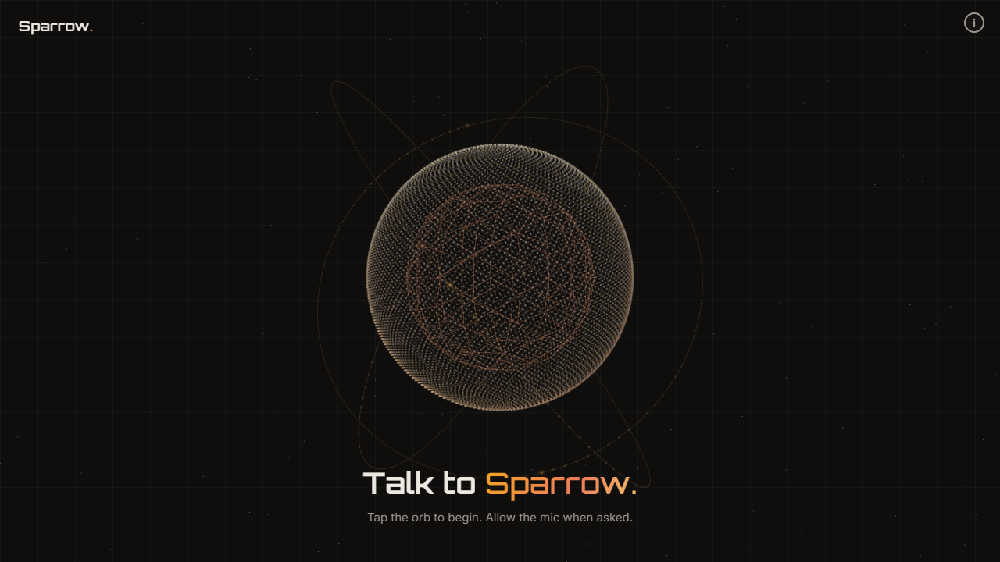
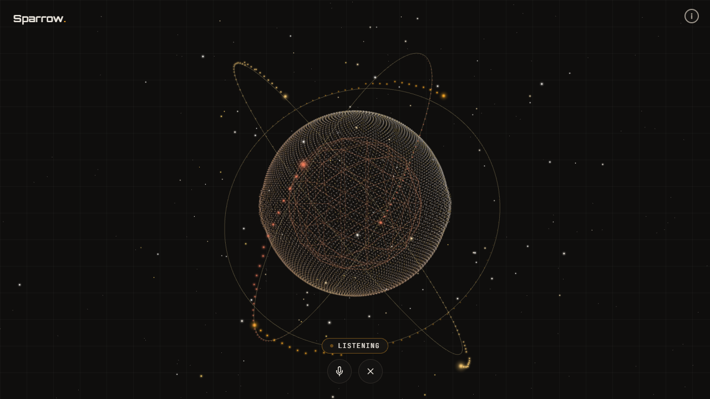
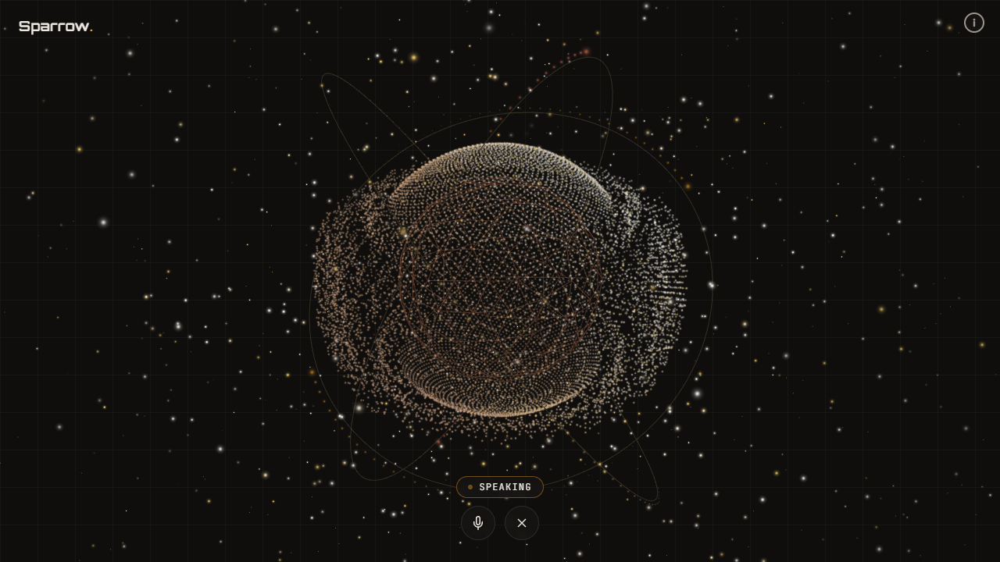
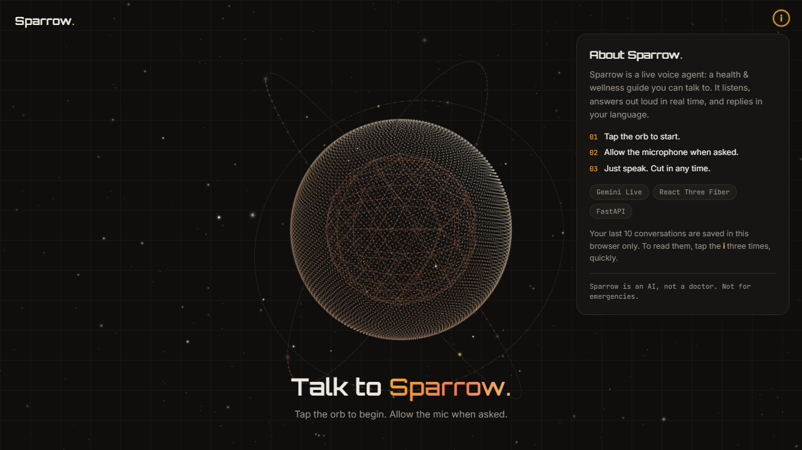
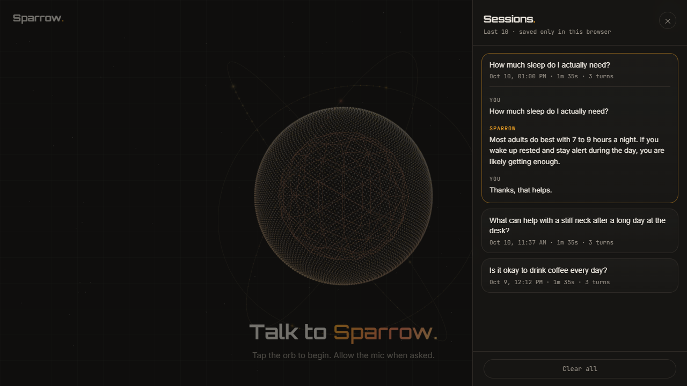

# Sparrow — a voice agent you can talk to

Tap a glowing 3D orb, say something, and Sparrow answers out loud, right away. It is a friendly **health and wellness guide** that replies in whatever language you speak.

Built on Google's **Gemini Live API** (Vertex AI), a **FastAPI** backend, and a **React + Three.js** frontend.



> Sparrow is an AI, not a doctor. It gives general guidance and points you to real care for anything serious.

## See it

| Listening | Speaking |
|---|---|
|  |  |
| Rings of light orbit the orb like an atom. Sound from your mic speeds them up and pulls tiny lights in. | The orb pumps with Sparrow's voice and throws particles out into the space around it. |

| About card | Past sessions |
|---|---|
|  |  |
| The small **i** in the corner explains what this is. | Tap the **i** three times fast to read your last 10 conversations. |

## What makes it good

- **It answers fast.** Opening a connection to Gemini takes about 2.5 seconds. Sparrow keeps a few connections open and ready (a "warm pool"), so the wait is almost zero when you tap.
- **Long chats don't get cut off.** One Gemini connection lasts about 10 minutes. Sparrow quietly reconnects and carries on, up to a time limit you set.
- **Answers use the live web.** Google Search is switched on, so health answers can come from current, trusted sources.
- **No transcript on screen.** The conversation lives in the orb. You hear it, you don't read it.
- **Your history stays with you.** The last 10 conversations are saved in your own browser only. Nothing is stored on a server.
- **Looks like my portfolio.** The colors and fonts match, so it can be dropped in as a live demo.

## How it works

```
Browser  <--- WebSocket --->  FastAPI backend  <--- google-genai --->  Gemini Live API
 mic (16 kHz) ------------->   warm session pool                       (Vertex AI, us-central1)
 speaker (24 kHz) <---------   + auto-reconnect
```

1. You tap the orb. The browser opens the mic and a WebSocket to the backend.
2. The backend hands you a ready-made Gemini session from the pool.
3. Your voice goes to Gemini. Gemini's voice comes back and plays instantly.
4. The orb reads the sound of both voices and moves to match.

The orb is built in `frontend/src/components/scene/`. It reads the mic and the speaker through small audio analyzers, so every movement follows the real sound.

## Run it on your computer

You need: Python 3.10+, Node 18+, and a Google Cloud project with the **Vertex AI API** turned on and Application Default Credentials set up.

**Backend**

```bash
cd backend
pip install -r requirements.txt
python main.py        # http://localhost:8000
```

Set these first:

| Variable | What it is |
|---|---|
| `GOOGLE_CLOUD_PROJECT` | Your Google Cloud project ID |
| `GOOGLE_APPLICATION_CREDENTIALS` | Path to a service account key file (only if you don't use ADC) |

**Frontend**

```bash
cd frontend
npm install
npm run dev           # http://localhost:5173
```

Open it, tap the orb, allow the mic, and talk.

## Settings you can change

All in `backend/config.py`:

| Setting | Default | What it does |
|---|---|---|
| `POOL_SIZE` | `5` | How many ready-to-use sessions to keep |
| `POOL_MAX_AGE_S` | `240` | Refresh an idle session after this many seconds |
| `POOL_CHECKOUT_TIMEOUT_S` | `0.25` | How long to wait for a ready session before connecting fresh |
| `SESSION_BUDGET_S` | `600` | How long one conversation may last in total |

## The messages between browser and backend

**Browser to backend**

| Message | What it carries |
|---|---|
| `setup` | Sent once on connect. Language fields are kept for compatibility, but the backend ignores them. |
| `audio` | A chunk of your mic audio (16 kHz, 16-bit, base64) |
| `stop` | End the session |

**Backend to browser**

| Message | What it carries |
|---|---|
| `setup_complete` | The session is ready, and how long it took to get |
| `audio_output` | A chunk of Sparrow's voice (24 kHz, 16-bit, base64) |
| `input_transcript` / `output_transcript` | Text of what you said / what Sparrow said (saved to history, not shown live) |
| `turn_complete` / `interrupted` | Sparrow finished, or you cut in |
| `server_first_audio` | Speed measurement for the first reply |
| `error` | Something went wrong |

The backend also serves `GET /health`.

## What's in the folders

```
backend/      FastAPI app, warm session pool, auto-reconnect wrapper, settings
frontend/     React app
  src/components/scene/   the 3D orb (Three.js)
  src/components/         info tag, history panel, main stage
  src/hooks/              mic capture, speaker playback, WebSocket, session recorder
agent/        next version, being built on LiveKit Agents (in progress)
docs/         plans and screenshots
```

## Good to know

- **Developer panel.** The latency dashboard (how fast the first reply was, and why) is built in but hidden from visitors. A developer mode to open it is planned.
- **LiveKit.** I am moving the audio layer to LiveKit. The plan is in `docs/livekit-migration-plan.md`.
- **Search grounding.** In `us-central1` Google Search runs on Google's side. Some other regions send it back as a function call instead, which this app does not answer yet.
- **Pin the SDK.** `google-genai` is not version-pinned in `requirements.txt`. Pin it (`>=1.0,<2`) before depending on it.
- **Reconnect gap.** When Sparrow reconnects after the 10-minute limit, the last half-second of a reply can be lost, once per reconnect.
